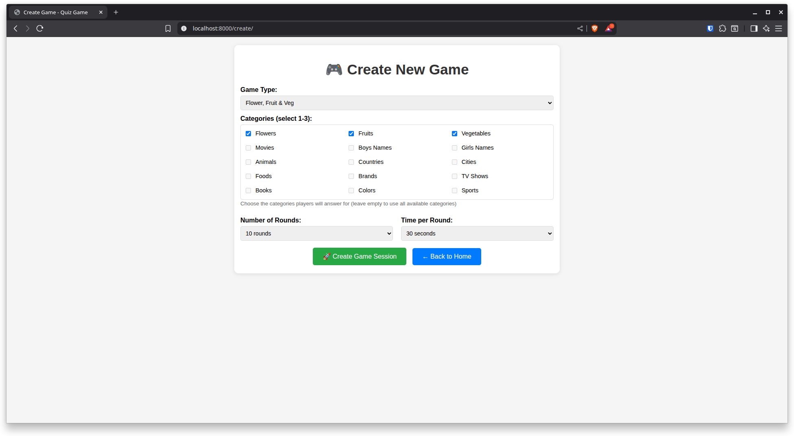

# NewQuiz

## Screenshots

### Home Screen


### Game Master Dashboard


### Players Joined


### Game Master Question View


### Game Master Validation


### Player Join Screen


### Player Game Screen


### Player Waiting


### Player Correct Answer


### Player Incorrect Answer


### Game Example - Flower/Fruit/Vegetable


## Project Status

- **Repository initialized:** Local project placed under git version control and pushed to GitHub ([NewQuiz repo](https://github.com/shawncarter/NewQuiz)).
- **Current state:** Stable, pre-refactoring snapshot. All files and dependencies are included as per the initial commit.
- **Next steps:** Major refactoring planned to improve code structure and maintainability.

## How to Run

1. Clone the repository:
   ```bash
   git clone https://github.com/shawncarter/NewQuiz.git
   ```
2. (Optional) Set up a virtual environment and install dependencies:
   ```bash
   python -m venv venv
   source venv/bin/activate
   pip install -r requirements.txt
   ```
3. Run the application as per your framework's instructions (update this section as needed).

## Notes
- This README will be updated as the project evolves, especially after major refactoring.
- For issues or contributions, please use the GitHub repo.
